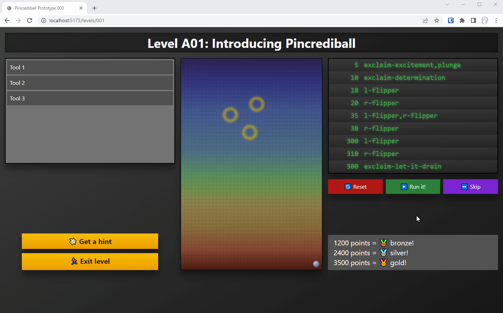

# Pincrediball Prototype 003

This is the third prototype, published purely for fun.
There will probably be no further documentation or info or updates on this repository.

Check out [the pincrediball.com devlog](https://www.pincrediball.com/devlog) for more in-depth updates about development.

## Screen recording

Here's a quick screen recording from abovementioned devlog that shows how this prototype worked:

